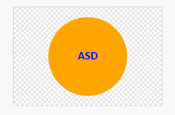

# SVG-Logo-Generator

## Description
- Application focusing on node.js, inquirer, and jest to create an SVG logo generator.
- Users are prompted to type 3 leters, a shape, and desired text and shape color.
- Link to tutorial video: https://drive.google.com/file/d/1dhyHZ8WYS77yL4Zm-BaPaRkiumzOglKD/view
- 

## Usage
- This application allows users to create an SVG logo optimal for their own web applications, illustrations, and other projects.

## Credits
- N/A

## License 
- License within the repository.